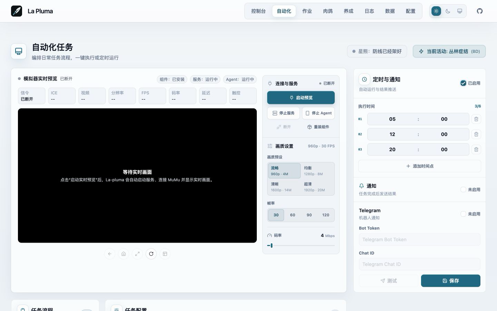
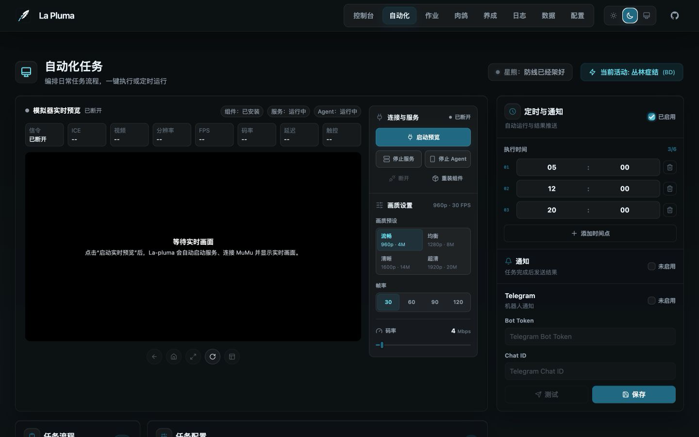
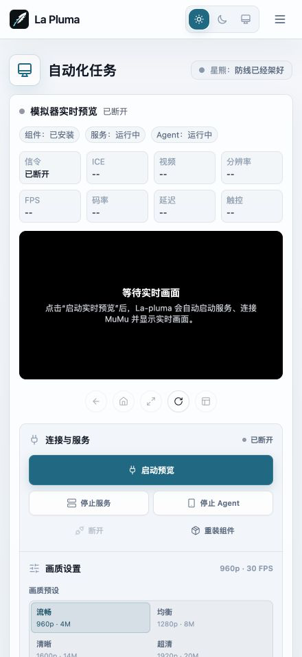
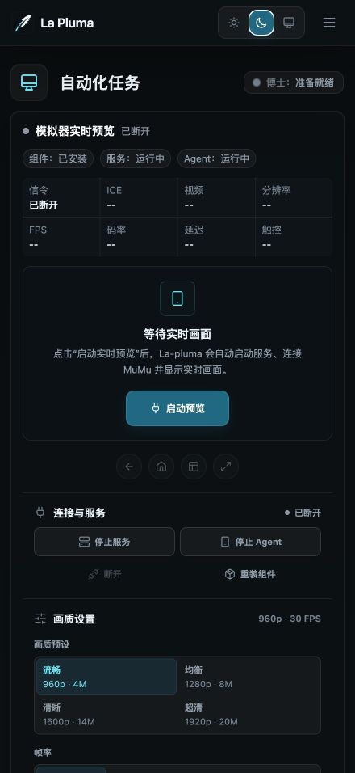

# La Pluma

<div align="center">
  
  <p><em>MAA CLI 的现代化 WebUI 与本地 Agent 控制台</em></p>
  
  [](https://hub.docker.com/r/miaona/la-pluma)
  [](https://hub.docker.com/r/miaona/la-pluma)
  [](https://github.com/mps233/La-pluma/actions)
</div>

> **项目名称由来**：La Pluma（羽毛笔）是《明日方舟》中的五星近卫干员，本项目以此命名，致敬这位优雅的女士。

## ✨ 特性

- 🧭 **控制台总览** - 汇总今日活动、森空岛数据、任务状态、实时预览和掉落信息
- 🎮 **自动化任务流程** - 启动游戏、理智作战、基建换班、自动公招、信用收支、领取奖励、关闭游戏
- 🎯 **多关卡支持** - 每个关卡独立设置次数，支持活动关卡代号自动替换（HD-X → OR-X）
- 🧠 **智能检测** - 资源本开放日检测、理智耗尽自动停止、游戏状态监控
- ⏰ **定时任务** - 支持多个定时任务，实时显示执行状态和进度
- 🖥️ **模拟器预览** - 集成 ScrcpyOverWebRTC，支持网页内查看和基础设备控制
- 📊 **数据与养成** - 识别仓库和干员 Box，统计掉落，生成干员养成材料计划
- 🏝️ **森空岛集成** - 登录森空岛并读取博士、基建、干员和资源数据
- 📱 **Telegram 通知** - 任务完成后发送通知，包含截图和详细总结
- 🤖 **Bot 远程控制** - 通过 Telegram Bot 远程执行任务
- 🤖 **Agent API** - 通过 `/api/agent` 暴露 manifest/status/actions，方便 AI 或脚本调用
- 🎨 **现代化 UI** - Tailwind CSS + Framer Motion，支持深色模式
- 📲 **PWA 支持** - 可安装为独立应用，支持离线使用
- 🔄 **实时更新** - WebSocket 实时推送任务状态和日志

## 📸 界面预览

### Web 端

<div align="center">
  
  
  <p><em>Web 端 - 浅色模式 & 深色模式</em></p>
</div>

### 移动端

<div align="center">
  
  
  <p><em>移动端 - 浅色模式 & 深色模式</em></p>
</div>

## 🧭 当前架构

La Pluma 是一个面向《明日方舟》自动化的本地 Web 控制台。前端负责配置、编排和可视化；后端负责调用 `maa` CLI、ADB、ScrcpyOverWebRTC、森空岛 API 和本地 JSON 配置。

当前后端入口主要挂载两类 API：

- `/api/agent` - 主控制接口，覆盖 MAA 命令、任务状态、日志、截图、WebRTC、森空岛、养成、调度、通知和数据接口。
- `/api/operator-quotes` - 干员语音/台词相关接口。

仓库中仍保留部分历史路由文件作为迁移参考，但当前前端 API 封装主要对接 `/api/agent`。

## 🤖 Agent API

La Pluma 提供一层给 AI/Agent 使用的轻量控制接口。它不是前端内部 API 的简单暴露，而是更语义化的 manifest/status/actions 层，方便 Hermes、Claude、Cursor 或自定义自动化直接发现能力、读取状态和执行安全动作。Web 前端也在逐步统一到这套 `/api/agent` 接口上。

### 发现能力

```bash
curl http://localhost:3000/api/agent/manifest
curl http://localhost:3000/api/agent/openapi.json
```

### 读取状态

```bash
curl http://localhost:3000/api/agent/status
```

返回内容会汇总：MAA 版本、任务状态、ADB 连接、前台窗口、WebRTC 预览可用性、最近日志和下一步建议。

### 常用动作

```bash
# 检查模拟器连接
curl -X POST http://localhost:3000/api/agent/actions/test-connection \
  -H 'Content-Type: application/json' \
  -d '{"adbPath":"/opt/homebrew/bin/adb","address":"127.0.0.1:16384"}'

# WebRTC 实时预览
curl -X POST http://localhost:3000/api/agent/webrtc/start \
  -H 'Content-Type: application/json' \
  -d '{"address":"127.0.0.1:16384","deviceId":"mumu-la-pluma"}'

# 读取实时预览状态
curl http://localhost:3000/api/agent/webrtc/status

# 启动游戏
curl -X POST http://localhost:3000/api/agent/actions/start-game \
  -H 'Content-Type: application/json' \
  -d '{"clientType":"Official","address":"127.0.0.1:16384","waitForCompletion":true}'

# 执行白名单 maa-cli 任务
curl -X POST http://localhost:3000/api/agent/actions/run-task \
  -H 'Content-Type: application/json' \
  -d '{"command":"award","args":["Official","-a","127.0.0.1:16384"],"waitForCompletion":true}'

# 停止当前任务
curl -X POST http://localhost:3000/api/agent/actions/stop
```

如果设置了 `LA_PLUMA_TOKEN`，Agent API 和其它 `/api/*` 一样需要 Bearer token 或 `X-La-Pluma-Token`。

## 📋 前置要求

- **操作系统**: macOS / Linux
- **Node.js** 18+
- **MAA CLI** 已安装
  - macOS: `brew install MaaAssistantArknights/tap/maa-cli`
  - Linux: 参考 [MAA CLI 文档](https://maa.plus/docs/manual/cli/)
- 已执行 `maa install` 安装 MaaCore 及资源

## 🖥️ 跨平台支持

La Pluma 支持 macOS 和 Linux 系统。项目会自动检测操作系统并使用对应的配置路径：

### 配置文件路径

- **macOS**: `~/Library/Application Support/com.loong.maa/`
- **Linux**: `~/.config/maa/` (遵循 XDG 标准)

服务器启动时会自动显示当前系统的路径配置。

## 🚀 快速开始

### 方式 1: 本地安装（推荐）

#### 1. 克隆仓库

```bash
git clone https://github.com/mps233/La-pluma.git
cd La-pluma
```

#### 2. 安装依赖

```bash
# 安装所有依赖（根目录、前端、后端）
npm run install:all
```

#### 3. 启动服务

```bash
# 同时启动前端和后端
npm run dev

# 或分别启动
npm run dev:client  # 前端: http://localhost:5173
npm run dev:server  # 后端: http://localhost:3000
```

#### 4. 访问应用

打开浏览器访问 http://localhost:5173

### 方式 2: Docker 部署

> ✨ **推荐方式**：使用 Docker Hub 预构建镜像，开箱即用！

#### 使用 Docker Hub 镜像（推荐）

```bash
# 拉取最新镜像
docker pull miaona/la-pluma:latest

# 运行容器
docker run -d \
  --name la-pluma \
  -p 3055:3000 \
  -v /path/to/data:/app/server/data \
  -v /path/to/config:/root/.config/maa \
  -v /path/to/maacore:/root/.local/share/maa \
  -e ADB_ADDRESS=192.168.x.x:5555 \
  miaona/la-pluma:latest

# 如需开启 API 鉴权，把下面一行插入到镜像名前：
#   -e LA_PLUMA_TOKEN=change-me \

# 访问应用
# 浏览器打开 http://localhost:3055
```

可选环境变量：

| 变量 | 说明 | 默认值 |
| --- | --- | --- |
| `PORT` | 后端监听端口 | `3000` |
| `ADB_PATH` | ADB 可执行文件路径 | `/opt/homebrew/bin/adb` |
| `ADB_ADDRESS` | 默认 ADB 设备地址 | `127.0.0.1:16384` |
| `MAA_CLI_PATH` | `maa` CLI 可执行文件路径 | 本地为 `maa`，Docker 为 `/usr/local/bin/maa` |
| `MAA_CLIENT_TYPE` | 默认客户端类型 | `Official` |
| `LA_PLUMA_TOKEN` | 设置后 `/api/*` 需要 `Authorization: Bearer <token>` 或 `X-La-Pluma-Token` | 空，不启用 |
| `LA_PLUMA_MAX_REALTIME_LOGS` | 实时日志内存缓存最大行数 | `5000` |
| `LA_PLUMA_WEBRTC_DIR` | ScrcpyOverWebRTC 工作目录 | `$HOME/ScrcpyOverWebRTC` |
| `LA_PLUMA_WEBRTC_PORT` | ScrcpyOverWebRTC 本地端口 | `8443` |

#### 使用 Docker Compose（推荐）

```bash
# 1. 克隆仓库
git clone https://github.com/mps233/La-pluma.git
cd La-pluma

# 2. 编辑 docker-compose.yml，修改 volumes 和 ADB_ADDRESS
nano docker-compose.yml

# 3. 启动服务（会自动拉取镜像）
docker-compose up -d

# 4. 查看日志
docker-compose logs -f
```

#### 本地构建镜像

如果需要修改代码后构建：

```bash
# 编辑 docker-compose.yml
# 注释掉: image: miaona/la-pluma:latest
# 取消注释: build 部分

# 构建并启动
docker-compose up -d --build
```

**配置说明**：
- 宿主机端口：`3055`，容器内端口：`3000`
- 数据持久化：`./docker-data/` 和 `./server/data/`
- ADB 连接：在 WebUI 中配置设备地址（如 `127.0.0.1:5555`）
- 首次启动会自动下载 MaaCore（约 5-10 分钟）

**支持架构**：
- `linux/amd64` - x86_64 服务器、PC
- `linux/arm64` - ARM64 服务器、Apple Silicon

## 📦 项目结构

```
la-pluma/
├── client/                    # 前端 (React + TypeScript + Vite + Tailwind CSS)
│   ├── src/
│   │   ├── components/        # UI 组件
│   │   │   ├── Dashboard.tsx          # 控制台总览
│   │   │   ├── AutomationTasks.tsx    # 自动化任务流程
│   │   │   ├── CombatTasks.tsx        # 作业、SSS、悖论模拟
│   │   │   ├── RoguelikeTasks.tsx     # 肉鸽模式
│   │   │   ├── OperatorTraining.tsx   # 干员养成计划
│   │   │   ├── DataStatistics.tsx     # 仓库、干员和掉落数据
│   │   │   ├── LogViewer.tsx          # 日志查看
│   │   │   ├── ConfigManager.tsx      # 配置管理
│   │   │   ├── ScreenMonitor.tsx      # 截图与设备预览
│   │   │   ├── ScrcpyDeviceView.tsx   # WebRTC 实时预览
│   │   │   └── ...
│   │   ├── services/          # API 调用
│   │   │   └── api.ts         # /api/agent API 封装
│   │   ├── stores/            # Zustand 状态管理
│   │   ├── hooks/             # 预览、API 请求等 Hook
│   │   └── utils/             # 工具函数
│   └── public/                # 静态资源（Logo、图标）
├── server/                    # 后端 (Node.js + Express)
│   ├── routes/                # API 路由
│   │   ├── agent.js           # 主 Agent API
│   │   └── operatorQuotes.js  # 干员台词接口
│   ├── services/              # 业务逻辑
│   │   ├── maaService.js      # MAA CLI、ADB、截图、实时日志
│   │   ├── schedulerService.js # 定时任务调度
│   │   ├── notificationService.js # 通知服务
│   │   ├── sklandService.js   # 森空岛登录和数据读取
│   │   ├── operatorTrainingService.js # 养成计划和材料计算
│   │   ├── webrtcService.js   # ScrcpyOverWebRTC 管理
│   │   └── configStorageService.js # 配置存储
│   ├── data/                  # 用户配置数据
│   │   └── user-configs/      # 任务配置 JSON 文件
│   └── server.js              # 服务器入口
├── package.json               # 根目录脚本
└── README.md                  # 项目文档
```

## 🎯 核心功能

### 控制台总览

- ✅ **今日活动** - 查看当前活动、开放资源本和推荐操作
- ✅ **博士信息** - 通过森空岛读取账号、资源、基建和干员概览
- ✅ **实时预览** - 通过 ScrcpyOverWebRTC 查看模拟器画面
- ✅ **状态汇总** - 聚合当前任务、调度、掉落和养成数据

### 自动化任务流程

- ✅ **启动游戏** - 自动启动明日方舟客户端
- ✅ **理智作战** - 支持多关卡，每个关卡独立次数设置
  - 自动替换活动关卡代号（HD-X → OR-X）
  - 资源本开放日检测（CE-6、AP-5、CA-5、SK-5、LS-6）
  - 理智耗尽自动停止后续关卡
  - 支持剿灭作战（Annihilation）
- ✅ **基建换班** - 自动收菜、换班、无人机加速
- ✅ **自动公招** - 自动刷新、选择标签、确认招募
- ✅ **信用收支** - 自动访问好友、收取信用、购买商品
- ✅ **领取奖励** - 自动领取每日、每周、邮件等奖励
- ✅ **关闭游戏** - 任务完成后自动关闭游戏

### 定时任务

- 支持多个定时任务，每个任务独立配置
- 实时显示执行状态和进度动画
- 任务完成后自动发送 Telegram 通知

### 作业与肉鸽

- 支持普通作业、作业集、SSS 作业和悖论模拟
- 支持从链接或关卡名搜索作业
- 支持集成战略、生息演算等长流程任务

### 数据与养成

- 从 MAA 识别结果解析仓库和干员 Box
- 读取材料数据库和关卡开放日，计算干员精二/技能所需材料
- 维护养成队列，并可将养成计划应用回自动化任务流程
- 记录并统计掉落数据

### Telegram 通知

- 任务完成通知（成功/失败/跳过统计）
- 自动截图并发送
- 详细的任务总结（关卡、次数、掉落、耗时）

## ⚙️ 配置说明

### ADB 连接配置

在"自动化任务"页面配置 ADB 连接：

- **ADB 路径**：默认 `/opt/homebrew/bin/adb`
- **设备地址**：
  - 本地模拟器：`emulator-5554` 或 `127.0.0.1:5555`
  - 远程设备：`192.168.x.x:16384`（需要开启网络 ADB）

### Telegram 通知配置

在"通知设置"页面配置：

1. 创建 Telegram Bot（通过 @BotFather）
2. 获取 Bot Token
3. 获取 Chat ID（通过 @userinfobot）
4. 填入配置并测试

**Bot 远程控制**：配置完成后，Bot 会自动启动，支持以下命令：

```
/help - 显示帮助信息
/status - 查看当前任务状态
/fight <关卡> - 执行理智作战（例如：/fight 1-7）
/roguelike [主题] - 执行肉鸽任务（例如：/roguelike Sami）
/stop - 停止当前任务
```

**注意**：Bot 只响应配置的 Chat ID，其他用户无法控制。

## 🛠️ 技术栈

- **前端框架**: React 19 + TypeScript + Vite
- **UI 框架**: Tailwind CSS + Framer Motion
- **图标**: Lucide React
- **状态管理**: Zustand
- **后端**: Node.js + Express
- **实时通信**: Socket.io
- **MAA 集成**: 通过子进程调用 `maa` CLI 命令
- **模拟器连接**: ADB + ScrcpyOverWebRTC
- **数据来源**: MAA 识别结果、森空岛 API、本地游戏数据 JSON
- **通知服务**: Telegram Bot API 和任务完成通知

## 📝 开发指南

项目使用 React + TypeScript + Node.js 技术栈，代码结构围绕“前端页面、Agent API、后端服务”展开。

### 主要技术点

- **前端**: React Hooks + Tailwind CSS 实现响应式 UI，Zustand 管理跨页面状态
- **API**: 前端通过 `client/src/services/api.ts` 访问 `/api/agent/*`
- **后端**: `server/server.js` 挂载 Agent API，并用 Socket.IO 推送运行状态
- **MAA 集成**: 通过 Node.js 子进程调用 `maa` CLI 命令
- **定时任务**: 使用 node-cron 实现任务调度
- **通知服务**: Telegram Bot API + 任务完成通知

### 常用检查

```bash
# 前端类型检查和构建
cd client && npm run build

# 后端语法检查
cd server && npm run check
```

## 🤝 贡献

欢迎提交 Issue 和 Pull Request！

## 📄 许可证

MIT License

## 🙏 致谢

- [MAA (MaaAssistantArknights)](https://github.com/MaaAssistantArknights/MaaAssistantArknights) - 明日方舟游戏助手
- [maa-cli](https://github.com/MaaAssistantArknights/maa-cli) - MAA 命令行工具
