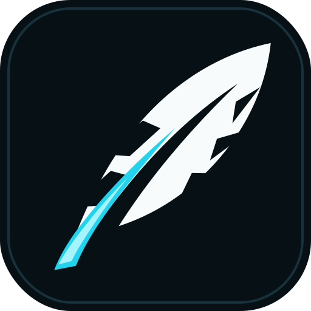
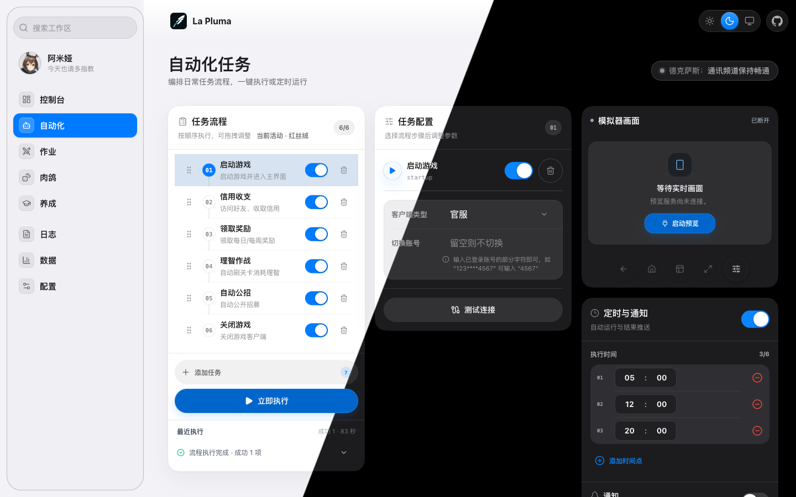
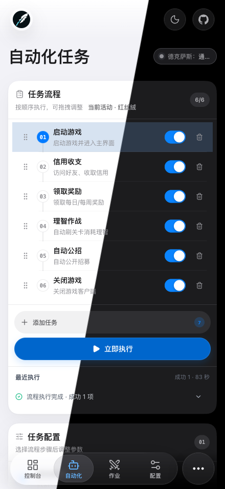

# La Pluma

<div align="center">
  
  <p><em>MAA CLI 的现代化 WebUI 与本地 Agent 控制台</em></p>
  
  [](https://hub.docker.com/r/miaona/la-pluma)
  [](https://hub.docker.com/r/miaona/la-pluma)
  [](https://github.com/mps233/La-pluma/actions)
</div>

> **项目名称由来**：La Pluma（羽毛笔）是《明日方舟》中的五星近卫干员，本项目以此命名，致敬这位优雅的女士。

## ✨ 特性

- 🧭 **控制台总览** - 汇总今日活动、任务状态、实时预览和掉落信息
- 🎮 **自动化任务流程** - 启动游戏、理智作战、基建换班、自动公招、信用收支、领取奖励、关闭游戏
- 🎯 **多关卡支持** - 每个关卡独立设置次数，支持活动关卡代号自动替换（HD-X → OR-X）
- 🧠 **智能检测** - 日常/芯片本开放日检测、理智耗尽自动停止、游戏状态监控
- ⏰ **定时任务** - 支持多个定时任务，实时显示执行状态和进度
- 🖥️ **模拟器预览** - 集成 ScrcpyOverWebRTC，支持网页内查看和基础设备控制
- 📊 **数据与养成** - 识别仓库和干员 Box，统计掉落，生成干员养成材料计划
- 📱 **Telegram 通知** - 任务完成后发送通知，包含截图和详细总结
- 🤖 **Bot 远程控制** - 通过 Telegram Bot 远程执行任务
- 🤖 **Agent API** - 通过 `/api/agent` 暴露 manifest/status/actions，方便 AI 或脚本调用
- 🎨 **现代化 UI** - Framework7 9 iOS 风格壳层 + Tailwind CSS + Framer Motion，支持深色模式
- 📲 **PWA 支持** - 在 HTTPS 或 localhost 下可安装，离线可打开已缓存界面
- 🔄 **实时更新** - WebSocket 实时推送任务状态和日志

## 📸 界面预览

### Web 端

<p align="center">
  
  <br />
  <em>自动化任务桌面端</em>
</p>

### 移动端

<p align="center">
  
  <br />
  <em>自动化任务移动端</em>
</p>

## 🧭 当前架构

La Pluma 是一个面向《明日方舟》自动化的本地 Web 控制台。前端负责配置、编排和可视化；后端负责调用 `maa` CLI、ADB、ScrcpyOverWebRTC 和本地 JSON 配置。

当前后端入口主要挂载两类 API：

- `/api/agent` - 主控制接口，覆盖 MAA 命令、任务状态、日志、截图、WebRTC、养成、调度、通知和数据接口。
- `/api/operator-quotes` - 干员语音/台词相关接口。

历史拆分路由已清理；新增功能应优先接入 `/api/agent`。

### 前端 UI 与响应式壳层

前端使用 React 19、Framework7 9（`theme="ios"`）、Tailwind CSS 和 Framer Motion。Framework7 负责页面 chrome、导航栏、工具栏/tabbar、模态交互和 iOS 风格的基础行为；项目语义 token 与 `framework7-overrides.css` 负责与 La Pluma 的品牌色、信息密度和现有组件保持一致。

- 桌面端使用左侧工作台导航；移动端使用悬浮的 iOS 风格底部胶囊导航，右侧搜索/更多入口承载次要页面。两端共享同一套 URL 路由和页面状态。
- 主题由 `useUIStore` 管理，`light`、`dark`、`system` 会同步到文档根节点和 Framework7 根节点。页面组件不要自行切换 `.dark` 或另建主题状态。
- 页面启用 `viewport-fit=cover`。Framework7 navbar、toolbar/tabbar 已包含对应安全区处理；自定义固定层只在自身不属于 Framework7 chrome 时补充 `env(safe-area-inset-*)`，避免重复留白。
- 通用组件在 `Framework7RuntimeProvider` 内使用 Framework7 实现；测试、SSR 或嵌入式渲染脱离该 provider 时保留原生 fallback，这是有意的兼容行为。

新增页面应复用现有 Layout、common 组件和语义 token；不要重复创建桌面侧栏、移动 tabbar 或页面级安全区计算。

## 🤖 Agent API

La Pluma 提供一层给 AI/Agent 使用的轻量控制接口。它不是前端内部 API 的简单暴露，而是更语义化的 manifest/status/actions 层，方便 Agent 或自定义自动化发现能力、读取状态和执行动作。Manifest 与 OpenAPI 由同一份能力清单生成，并公开每个动作的风险、dry-run、轮询和停止方式。

### 发现能力

```bash
curl http://localhost:3000/api/agent/manifest
curl http://localhost:3000/api/agent/openapi.json
```

### 读取状态

```bash
curl http://localhost:3000/api/agent/status
```

返回内容会汇总：MAA 版本、任务状态、ADB 连接、前台窗口、WebRTC 预览可用性、最近日志和下一步建议。

连接相关接口默认读取 `profileId: "default"` 对应的连接配置，也可以选择其它已保存配置。显式传入的 `adbPath`、`address` 或 `clientType` 会覆盖该配置中的同名字段。

### 推荐执行流程

```bash
# 检查模拟器连接
curl -X POST http://localhost:3000/api/agent/actions/test-connection \
  -H 'Content-Type: application/json' \
  -d '{"profileId":"default"}'

# WebRTC 实时预览
curl -X POST http://localhost:3000/api/agent/webrtc/start \
  -H 'Content-Type: application/json' \
  -d '{"profileId":"default","deviceId":"mumu-la-pluma"}'

# 启动游戏
curl -X POST http://localhost:3000/api/agent/actions/start-game \
  -H 'Content-Type: application/json' \
  -H 'Idempotency-Key: start-game-20260712-01' \
  -d '{"profileId":"default","waitForCompletion":true}'

# 先检查理智作战计划，不触发 MAA
curl -X POST http://localhost:3000/api/agent/actions/fight \
  -H 'Content-Type: application/json' \
  -d '{"stages":[{"stage":"1-7","times":3}],"medicine":0,"stone":0,"dryRun":true}'

# 检查已保存的今日流程
curl -X POST http://localhost:3000/api/agent/actions/run-daily-flow \
  -H 'Content-Type: application/json' \
  -d '{"dryRun":true}'

# 确认计划后开始今日流程
curl -X POST http://localhost:3000/api/agent/actions/run-daily-flow \
  -H 'Content-Type: application/json' \
  -H 'Idempotency-Key: daily-flow-20260712-01' \
  -d '{"dryRun":false}'

# 轮询当前任务、流程状态和最近日志
curl 'http://localhost:3000/api/agent/runs/current?lines=80'

# 按启动响应中的 runId 查询本次执行，即使任务已经结束仍可读取终态
curl 'http://localhost:3000/api/agent/runs/00000000-0000-4000-8000-000000000000'

# 只终止指定 run，避免误停随后启动的其它任务
curl -X POST http://localhost:3000/api/agent/actions/stop \
  -H 'Content-Type: application/json' \
  -d '{"runId":"00000000-0000-4000-8000-000000000000"}'
```

所有标准响应都包含 `success`、`message` 和 `meta`。真实执行响应还包含稳定的 `runId`、`run`、`pollUrl` 和 `stopUrl`；后台接受执行时返回 HTTP `202`。Dry-run 响应会设置 `meta.dryRun: true`；失败响应的 `error` 包含稳定的 `code`、`details` 与 `retryable`，执行器忙碌时返回 HTTP `409`。

`Idempotency-Key` 是可选请求头，适用于活动作业、启动游戏、理智作战、通用任务和今日流程。幂等键按执行动作分区；同一动作使用相同 key 和相同请求参数重试时不会再次启动，而是返回原 `runId`，对象键顺序不影响比较，但显式参数差异会被视为不同输入。相同 key 搭配不同输入会返回 `AGENT_IDEMPOTENCY_KEY_REUSED`。Run 与幂等记录默认持久化到 `server/data/agent-runs.json`，正常重启后仍会保留；重启时尚未结束的 run 会变为不可自动重试的 `interrupted`，且不会自动续跑。终态最多保留 24 小时和 500 条，达到数量上限时可能提前淘汰。

当前持久化保证以单个 La Pluma 服务实例为边界。不要让多个 Node.js 进程同时读写同一个 Run 存储文件；需要修改路径时可设置 `LA_PLUMA_AGENT_RUN_STORE`。

### 通用任务

优先使用 `fight`、`run-daily-flow` 等语义化动作。只有明确知道 MAA CLI 参数时，才使用高风险的通用白名单入口：

```bash
# 执行白名单 maa-cli 任务
curl -X POST http://localhost:3000/api/agent/actions/run-task \
  -H 'Content-Type: application/json' \
  -d '{"command":"award","args":[],"taskName":"领取奖励","waitForCompletion":true}'

# 执行动态任务配置
curl -X POST http://localhost:3000/api/agent/actions/run-task \
  -H 'Content-Type: application/json' \
  -d '{"command":"run","args":["agent-award"],"taskConfig":{"name":"领取奖励","type":"Award","params":{"award":true}},"waitForCompletion":true}'
```

如果设置了 `LA_PLUMA_TOKEN`，Agent API、其它 `/api/*` 以及 WebRTC 同源网关的票据入口都需要 `Authorization: Bearer <token>` 或 `X-La-Pluma-Token`。未设置时认证关闭。

## 📋 前置要求

- **操作系统**: macOS / Linux
- **Node.js** 22.12+
- **MAA CLI** 已安装
  - macOS: `brew install MaaAssistantArknights/tap/maa-cli`
  - Linux: 参考 [MAA CLI 文档](https://maa.plus/docs/manual/cli/)
- 已执行 `maa install` 安装 MaaCore 及资源

## 🖥️ 跨平台支持

La Pluma 支持 macOS 和 Linux 系统。项目会自动检测操作系统并使用对应的配置路径：

### 配置文件路径

- **macOS**: `~/Library/Application Support/com.loong.maa/`
- **Linux**: `~/.config/maa/` (遵循 XDG 标准)

服务器启动时会自动显示当前系统的路径配置。

## 🚀 快速开始

### 方式 1: 本地安装（推荐）

#### 1. 克隆仓库

```bash
git clone https://github.com/mps233/La-pluma.git
cd La-pluma
```

#### 2. 安装依赖

```bash
# 安装所有依赖（根目录、前端、后端）
npm run install:all
```

#### 3. 启动服务

```bash
# 同时启动前端和后端
npm run dev

# 或分别启动
npm run dev:client  # 前端: http://localhost:5173
npm run dev:server  # 后端: http://localhost:3000
```

#### 4. 访问应用

打开浏览器访问 http://localhost:5173

### 方式 2: Docker 部署

> ✨ **推荐方式**：使用 Docker Hub 预构建镜像，开箱即用！

#### 使用 Docker Hub 镜像（推荐）

```bash
# 拉取最新镜像
docker pull miaona/la-pluma:latest

# 运行容器
docker run -d \
  --name la-pluma \
  -p 3055:3000 \
  -v /path/to/data:/app/server/data \
  -v /path/to/config:/root/.config/maa \
  -v /path/to/maacore:/root/.local/share/maa \
  -e ADB_ADDRESS=192.168.x.x:5555 \
  miaona/la-pluma:latest

# 如需开启 API 鉴权，把下面一行插入到镜像名前：
#   -e LA_PLUMA_TOKEN=change-me \

# 访问应用
# 浏览器打开 http://localhost:3055
```

可选环境变量：

| 变量 | 说明 | 默认值 |
| --- | --- | --- |
| `PORT` | 后端监听端口 | `3000` |
| `LA_PLUMA_BASE_PATH` | 生产环境前端挂载路径，需与构建时 `VITE_BASE_PATH` 一致 | `/` |
| `ADB_PATH` | ADB 可执行文件路径 | `/opt/homebrew/bin/adb` |
| `ADB_ADDRESS` | 默认 ADB 设备地址 | `127.0.0.1:16384` |
| `MAA_CLI_PATH` | `maa` CLI 可执行文件路径 | 本地为 `maa`，Docker 为 `/usr/local/bin/maa` |
| `MAA_CLIENT_TYPE` | 默认客户端类型 | `Official` |
| `LA_PLUMA_TOKEN` | 设置后 `/api/*` 与 WebRTC 票据入口需要 Bearer Token 或 `X-La-Pluma-Token` | 空，不启用 |
| `LA_PLUMA_AGENT_RUN_STORE` | Agent Run 与幂等记录的持久化文件 | `server/data/agent-runs.json` |
| `LA_PLUMA_MAX_REALTIME_LOGS` | 实时日志内存缓存最大行数 | `5000` |
| `LA_PLUMA_WEBRTC_DIR` | ScrcpyOverWebRTC 工作目录 | `$HOME/ScrcpyOverWebRTC` |
| `LA_PLUMA_WEBRTC_PORT` | ScrcpyOverWebRTC 本地端口 | `8443` |
| `LA_PLUMA_HTTPS_CERT_PATH` | 可选 HTTPS 证书链路径，必须与私钥同时配置 | 空，使用 HTTP |
| `LA_PLUMA_HTTPS_KEY_PATH` | 可选 HTTPS 私钥路径，必须与证书同时配置 | 空，使用 HTTP |

#### PWA、HTTPS 与实时预览

PWA 的 Service Worker 只会在 HTTPS 或浏览器认可的本机 `localhost` 安全上下文中启用。生产构建在电脑本机通过 `http://localhost:*` 打开时可以安装；手机通过 `http://192.168.x.x:*` 访问时不能安装，也不会获得离线界面缓存。Vite 开发模式默认不注册 Service Worker。

La Pluma 可以直接使用可信证书启动 HTTPS：

```bash
npm run build --prefix client

NODE_ENV=production \
LA_PLUMA_HTTPS_CERT_PATH=/path/to/fullchain.pem \
LA_PLUMA_HTTPS_KEY_PATH=/path/to/privkey.pem \
npm run start --prefix server
```

Docker 部署时把证书只读挂载到容器，并同时设置这两个变量：

```bash
docker run -d \
  --name la-pluma \
  -p 3055:3000 \
  -v /path/to/certs:/app/certs:ro \
  -v /path/to/data:/app/server/data \
  -e LA_PLUMA_HTTPS_CERT_PATH=/app/certs/fullchain.pem \
  -e LA_PLUMA_HTTPS_KEY_PATH=/app/certs/privkey.pem \
  -e LA_PLUMA_TOKEN=change-me \
  miaona/la-pluma:latest
```

证书必须受访问设备信任，并覆盖实际使用的域名或 IP。仅在浏览器中临时忽略自签名证书警告，不能可靠满足 PWA 安装要求。网络访问建议始终配置 `LA_PLUMA_TOKEN`。

HTTPS 下的实时预览使用同源 `/webrtc-signaling` 网关并自动升级为 WSS，不再让浏览器直连不安全的 `ws://`。如果由 Caddy、Nginx 或 NAS 反向代理终止 TLS，需要把 `/api`、`/health` 和 `/webrtc-signaling` 一并转发到 La Pluma，并允许 `/webrtc-signaling` 的 WebSocket Upgrade。

PWA 缓存范围仅包含界面资源。断网时可以打开已缓存页面，但 MAA、ADB、实时预览、状态读取和所有自动化操作仍需要连接 La Pluma 后端；页面会持续显示断连状态并禁用控制台执行入口。

##### 子路径部署

部署到 `/la-pluma/` 等子路径时，需要在构建前设置：

```bash
VITE_BASE_PATH=/la-pluma/ npm run build --prefix client

NODE_ENV=production \
LA_PLUMA_BASE_PATH=/la-pluma/ \
npm run start --prefix server

# Docker 本地构建
docker build --build-arg VITE_BASE_PATH=/la-pluma/ -t la-pluma:local .
```

本地运行时要让 `LA_PLUMA_BASE_PATH` 与构建时的 `VITE_BASE_PATH` 保持一致；通过 Docker build arg 构建时，镜像会自动写入对应的运行时挂载路径。反向代理应保留 `/la-pluma/` 前缀转发，同时继续同源转发根路径 `/api`、`/health` 与 `/webrtc-signaling`。路径建议以前导和结尾 `/` 表示，构建与服务端都会自动规范常见写法。

#### 使用 Docker Compose（推荐）

```bash
# 1. 克隆仓库
git clone https://github.com/mps233/La-pluma.git
cd La-pluma

# 2. 编辑 docker-compose.yml，修改 volumes 和 ADB_ADDRESS
nano docker-compose.yml

# 3. 启动服务（会自动拉取镜像）
docker-compose up -d

# 4. 查看日志
docker-compose logs -f
```

#### 本地构建镜像

如果需要修改代码后构建：

```bash
# 编辑 docker-compose.yml
# 注释掉: image: miaona/la-pluma:latest
# 取消注释: build 部分

# 构建并启动
docker-compose up -d --build
```

**配置说明**：
- 宿主机端口：`3055`，容器内端口：`3000`
- 数据持久化：`./docker-data/` 和 `./server/data/`
- ADB 连接：在 WebUI 中配置设备地址（如 `127.0.0.1:5555`）
- 首次启动会自动下载 MaaCore（约 5-10 分钟）

**支持架构**：
- `linux/amd64` - x86_64 服务器、PC
- `linux/arm64` - ARM64 服务器、Apple Silicon

## 📦 项目结构

```
la-pluma/
├── client/                    # 前端 (React + TypeScript + Vite + Framework7 9 + Tailwind CSS)
│   ├── src/
│   │   ├── components/        # UI 组件
│   │   │   ├── Dashboard.tsx          # 控制台总览
│   │   │   ├── AutomationTasks.tsx    # 自动化任务流程
│   │   │   ├── CombatTasks.tsx        # 作业、SSS、悖论模拟
│   │   │   ├── RoguelikeTasks.tsx     # 肉鸽模式
│   │   │   ├── OperatorTraining.tsx   # 干员养成计划
│   │   │   ├── DataStatistics.tsx     # 仓库、干员和掉落数据
│   │   │   ├── LogViewer.tsx          # 日志查看
│   │   │   ├── ConfigManager.tsx      # 配置管理
│   │   │   ├── ScreenMonitor.tsx      # 截图与设备预览
│   │   │   ├── ScrcpyDeviceView.tsx   # WebRTC 实时预览
│   │   │   └── ...
│   │   ├── services/          # API 调用
│   │   │   └── api.ts         # /api/agent API 封装
│   │   ├── stores/            # Zustand 状态管理
│   │   ├── hooks/             # 预览、API 请求等 Hook
│   │   └── utils/             # 工具函数
│   └── public/                # 静态资源（Logo、图标）
├── server/                    # 后端 (Node.js + Express)
│   ├── routes/                # API 路由
│   │   ├── agent.js           # 主 Agent API
│   │   └── operatorQuotes.js  # 干员台词接口
│   ├── services/              # 业务逻辑
│   │   ├── maaService.js      # MAA CLI、ADB、截图、实时日志
│   │   ├── schedulerService.js # 定时任务调度
│   │   ├── notificationService.js # 通知服务
│   │   ├── operatorTrainingService.js # 养成计划和材料计算
│   │   ├── webrtcService.js   # ScrcpyOverWebRTC 管理
│   │   └── configStorageService.js # 配置存储
│   ├── data/                  # 用户配置数据
│   │   └── user-configs/      # 任务配置 JSON 文件
│   └── server.js              # 服务器入口
├── package.json               # 根目录脚本
└── README.md                  # 项目文档
```

## 🎯 核心功能

### 控制台总览

- ✅ **今日活动** - 查看当前活动、开放日常本和推荐操作
- ✅ **实时预览** - 通过 ScrcpyOverWebRTC 查看模拟器画面
- ✅ **状态汇总** - 聚合当前任务、调度、掉落和养成数据

### 自动化任务流程

- ✅ **启动游戏** - 自动启动明日方舟客户端
- ✅ **理智作战** - 支持多关卡，每个关卡独立次数设置
  - 自动替换活动关卡代号（HD-X → OR-X）
  - 日常/芯片本开放日检测（CE-6、AP-5、CA-5、SK-5、LS-6、PR-A/B/C/D）
  - 理智耗尽自动停止后续关卡
  - 支持剿灭作战（Annihilation）
- ✅ **基建换班** - 自动收菜、换班、无人机加速
- ✅ **自动公招** - 自动刷新、选择标签、确认招募
- ✅ **信用收支** - 自动访问好友、收取信用、购买商品
- ✅ **领取奖励** - 自动领取每日、每周、邮件等奖励
- ✅ **关闭游戏** - 任务完成后自动关闭游戏

### 定时任务

- 支持多个定时任务，每个任务独立配置
- 实时显示执行状态和进度动画
- 任务完成后自动发送 Telegram 通知

### 作业与肉鸽

- 支持普通作业、作业集、SSS 作业和悖论模拟
- 支持从链接或关卡名搜索作业
- 支持集成战略、生息演算等长流程任务

### 数据与养成

- 从 MAA 识别结果解析仓库和干员 Box
- 读取材料数据库和关卡开放日，计算干员精二/技能所需材料
- 维护养成队列，并可将养成计划应用回自动化任务流程
- 记录并统计掉落数据

### Telegram 通知

- 任务完成通知（成功/失败/跳过统计）
- 自动截图并发送
- 详细的任务总结（关卡、次数、掉落、耗时）

## ⚙️ 配置说明

### ADB 连接配置

在"自动化任务"页面配置 ADB 连接：

- **ADB 路径**：默认 `/opt/homebrew/bin/adb`
- **设备地址**：
  - 本地模拟器：`emulator-5554` 或 `127.0.0.1:5555`
  - 远程设备：`192.168.x.x:16384`（需要开启网络 ADB）

### Telegram 通知配置

在"通知设置"页面配置：

1. 创建 Telegram Bot（通过 @BotFather）
2. 获取 Bot Token
3. 获取 Chat ID（通过 @userinfobot）
4. 填入配置并测试

**Bot 远程控制**：配置完成后，Bot 会自动启动，支持以下命令：

```
/help - 显示帮助信息
/status - 查看当前任务状态
/fight <关卡> - 执行理智作战（例如：/fight 1-7）
/roguelike [主题] - 执行肉鸽任务（例如：/roguelike Sami）
/stop - 停止当前任务
```

**注意**：Bot 只响应配置的 Chat ID，其他用户无法控制。

## 🛠️ 技术栈

- **前端框架**: React 19 + TypeScript + Vite
- **UI 框架**: Framework7 9（iOS theme）+ Tailwind CSS + Framer Motion
- **图标**: Lucide React
- **状态管理**: Zustand
- **后端**: Node.js + Express
- **实时通信**: Socket.io
- **MAA 集成**: 通过子进程调用 `maa` CLI 命令
- **模拟器连接**: ADB + ScrcpyOverWebRTC
- **数据来源**: MAA 识别结果和本地游戏数据 JSON
- **通知服务**: Telegram Bot API 和任务完成通知

## 📝 开发指南

项目使用 React + TypeScript + Node.js 技术栈，代码结构围绕“前端页面、Agent API、后端服务”展开。

### 主要技术点

- **前端**: React Hooks + Framework7 9 实现页面壳层和响应式 chrome，Tailwind CSS/语义 token 负责业务布局，Zustand 管理跨页面状态
- **API**: 前端通过 `client/src/services/api.ts` 访问 `/api/agent/*`
- **后端**: `server/server.js` 挂载 Agent API，并用 Socket.IO 推送运行状态
- **MAA 集成**: 通过 Node.js 子进程调用 `maa` CLI 命令
- **定时任务**: 使用 node-cron 实现任务调度
- **通知服务**: Telegram Bot API + 任务完成通知

### 常用检查

```bash
# 前端类型检查和构建
cd client && npm run build

# 后端语法检查
cd server && npm run check
```

## 🤝 贡献

欢迎提交 Issue 和 Pull Request！

## 📄 许可证

MIT License

## 🙏 致谢

- [MAA (MaaAssistantArknights)](https://github.com/MaaAssistantArknights/MaaAssistantArknights) - 明日方舟游戏助手
- [maa-cli](https://github.com/MaaAssistantArknights/maa-cli) - MAA 命令行工具
